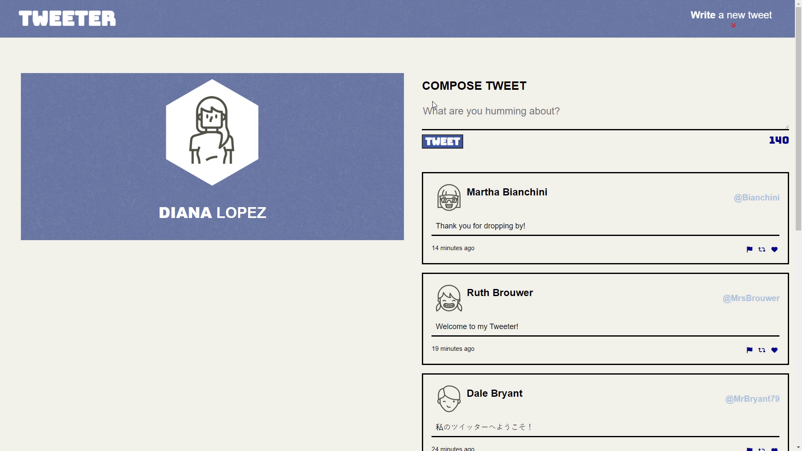

# Tweeter Project

Tweeter is a simple, single-page Twitter clone.

This Twitter-like application enables users to create and share tweets on a timeline. The application was developed using JavaScript, jQuery, and AJAX for the front-end, while Express and Node.js were used for the back-end. The app's content and layout were crafted using HTML and CSS for styling.

# Final Product

## Getting Started

1. Install dependencies using the `npm install` command.
2. Start the web server using the `npm run local` command. The app will be served at <http://localhost:8080/>.
3. Go to <http://localhost:8080/> in your browser.

## Core Features

- Begin by composing a tweet under 140 characters in the box that states "What are you humming about?" when ready to submit the tweet, click "Tweet" button.

- When tweet successfully submitted, the newly composed tweet will appear in the feed without refreshing the browser.

- If client attempts to submit a tweet without entering character or enters more than 140 characters, an error message will appear.

- This app uses responsive design that will adjust the browser according to the display size client is using.

## Screenshots

**Composing New Tweet in Main Tweeter Page**

**Main Tweeter Page with an Error Message when Submitting an Empty Tweet**

**Tweeter Page with an Error Message when Submitting a Tweet that is Too Long**

**Condensed Tweeter Page for Mobile View**

## Dependencies

- Express
- Node 5.10.x or above
- Nodemon
- Chance
- md5

## Conclusion

Thank you for checking out my Tweeter project!

---

Project by [Diana](https://github.com/dialop/tweeter) as a part of the Lighthouse Labs program curriculum.
